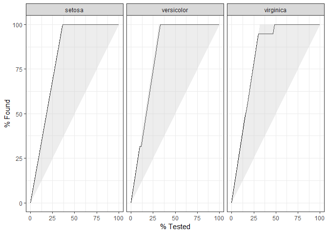
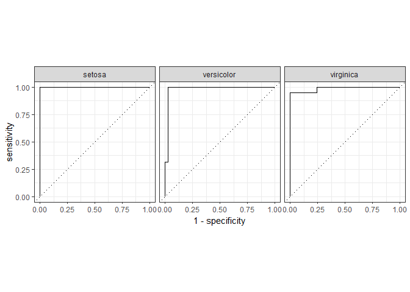

tidymodels\_try
================

``` r
iris_split <- initial_split(iris, prop = 0.6)
iris_split
```

    ## <90/60/150>

``` r
iris_split %>% 
  testing() %>% 
  glimpse()
```

    ## Observations: 60
    ## Variables: 5
    ## $ Sepal.Length <dbl> 5.1, 4.7, 5.4, 4.6, 5.4, 4.8, 5.8, 5.7, 5.4, 5.1,...
    ## $ Sepal.Width  <dbl> 3.5, 3.2, 3.9, 3.4, 3.7, 3.4, 4.0, 3.8, 3.4, 3.7,...
    ## $ Petal.Length <dbl> 1.4, 1.3, 1.7, 1.4, 1.5, 1.6, 1.2, 1.7, 1.7, 1.5,...
    ## $ Petal.Width  <dbl> 0.2, 0.2, 0.4, 0.3, 0.2, 0.2, 0.2, 0.3, 0.2, 0.4,...
    ## $ Species      <fct> setosa, setosa, setosa, setosa, setosa, setosa, s...

``` r
iris_recipe <- iris_split %>% 
  training() %>% 
  recipe(Species ~ .) %>% 
  step_corr(all_predictors()) %>% 
  step_center(all_predictors(), -all_outcomes()) %>%  # why need to exclude outcomes explicitly?
  step_scale(all_predictors(), -all_outcomes()) %>% 
  prep()
iris_recipe
```

    ## Data Recipe
    ## 
    ## Inputs:
    ## 
    ##       role #variables
    ##    outcome          1
    ##  predictor          4
    ## 
    ## Training data contained 90 data points and no missing data.
    ## 
    ## Operations:
    ## 
    ## Correlation filter removed Petal.Length [trained]
    ## Centering for Sepal.Length, Sepal.Width, Petal.Width [trained]
    ## Scaling for Sepal.Length, Sepal.Width, Petal.Width [trained]

``` r
iris_recipe2 <- iris_split %>% 
  training() %>% 
  recipe(Species ~ .) %>% 
  step_corr(all_predictors()) %>% 
  step_center(all_predictors()) %>%  # why need to exclude outcomes explicitly?
  step_scale(all_predictors()) %>% 
  prep()
iris_recipe2
```

    ## Data Recipe
    ## 
    ## Inputs:
    ## 
    ##       role #variables
    ##    outcome          1
    ##  predictor          4
    ## 
    ## Training data contained 90 data points and no missing data.
    ## 
    ## Operations:
    ## 
    ## Correlation filter removed Petal.Length [trained]
    ## Centering for Sepal.Length, Sepal.Width, Petal.Width [trained]
    ## Scaling for Sepal.Length, Sepal.Width, Petal.Width [trained]

``` r
iris_recipe %>% 
  bake(testing(iris_split))
```

    ## # A tibble: 60 x 4
    ##    Sepal.Length Sepal.Width Petal.Width Species
    ##           <dbl>       <dbl>       <dbl> <fct>  
    ##  1      -0.916        1.06        -1.37 setosa 
    ##  2      -1.41         0.342       -1.37 setosa 
    ##  3      -0.545        2.01        -1.11 setosa 
    ##  4      -1.54         0.818       -1.24 setosa 
    ##  5      -0.545        1.53        -1.37 setosa 
    ##  6      -1.29         0.818       -1.37 setosa 
    ##  7      -0.0495       2.25        -1.37 setosa 
    ##  8      -0.173        1.77        -1.24 setosa 
    ##  9      -0.545        0.818       -1.37 setosa 
    ## 10      -0.916        1.53        -1.11 setosa 
    ## # ... with 50 more rows

``` r
iris_testing <- iris_recipe2 %>% 
  bake(testing(iris_split))
iris_training <- juice(iris_recipe2)
```

``` r
iris_ranger <- rand_forest(trees = 100, mode = "classification") %>% 
  set_engine("ranger") %>% 
  fit(Species ~ ., data = iris_training)

iris_ranger
```

    ## parsnip model object
    ## 
    ## Ranger result
    ## 
    ## Call:
    ##  ranger::ranger(formula = formula, data = data, num.trees = ~100,      num.threads = 1, verbose = FALSE, seed = sample.int(10^5,          1), probability = TRUE) 
    ## 
    ## Type:                             Probability estimation 
    ## Number of trees:                  100 
    ## Sample size:                      90 
    ## Number of independent variables:  3 
    ## Mtry:                             1 
    ## Target node size:                 10 
    ## Variable importance mode:         none 
    ## Splitrule:                        gini 
    ## OOB prediction error (Brier s.):  0.08236017

``` r
iris_rf <- rand_forest(trees = 100, mode = "classification") %>% 
  set_engine("randomForest") %>% 
  fit(Species ~ ., data = iris_training)

iris_rf
```

    ## parsnip model object
    ## 
    ## 
    ## Call:
    ##  randomForest(x = as.data.frame(x), y = y, ntree = ~100) 
    ##                Type of random forest: classification
    ##                      Number of trees: 100
    ## No. of variables tried at each split: 1
    ## 
    ##         OOB estimate of  error rate: 8.89%
    ## Confusion matrix:
    ##            setosa versicolor virginica class.error
    ## setosa         28          0         0   0.0000000
    ## versicolor      0         27         4   0.1290323
    ## virginica       0          4        27   0.1290323

``` r
iris_ranger %>% 
  predict(iris_testing) %>% 
  bind_cols(iris_testing) %>% 
  glimpse()
```

    ## Observations: 60
    ## Variables: 5
    ## $ .pred_class  <fct> setosa, setosa, setosa, setosa, setosa, setosa, s...
    ## $ Sepal.Length <dbl> -0.91622717, -1.41148511, -0.54478372, -1.5352995...
    ## $ Sepal.Width  <dbl> 1.0568556, 0.3416901, 2.0104095, 0.8184671, 1.533...
    ## $ Petal.Width  <dbl> -1.36543315, -1.36543315, -1.10617369, -1.2358034...
    ## $ Species      <fct> setosa, setosa, setosa, setosa, setosa, setosa, s...

``` r
iris_ranger %>% 
  predict(iris_testing) %>% 
  bind_cols(iris_testing) %>% 
  metrics(truth = Species, estimate = .pred_class)
```

    ## # A tibble: 2 x 3
    ##   .metric  .estimator .estimate
    ##   <chr>    <chr>          <dbl>
    ## 1 accuracy multiclass     0.983
    ## 2 kap      multiclass     0.975

``` r
iris_rf %>% 
  predict(iris_testing) %>% 
  bind_cols(iris_testing) %>% 
  metrics(truth = Species, estimate = .pred_class)
```

    ## # A tibble: 2 x 3
    ##   .metric  .estimator .estimate
    ##   <chr>    <chr>          <dbl>
    ## 1 accuracy multiclass     0.983
    ## 2 kap      multiclass     0.975

``` r
iris_probs <- iris_ranger %>% 
  predict(iris_testing, type = "prob") %>% 
  bind_cols(iris_testing) 
  # glimpse()
```

``` r
iris_probs %>% 
  gain_curve(Species, .pred_setosa:.pred_virginica) %>% 
  autoplot()
```

<!-- -->

``` r
iris_probs %>% 
  roc_curve(Species, .pred_setosa:.pred_virginica) %>% 
  autoplot()
```

<!-- -->

``` r
predict(iris_ranger, iris_testing, type = "prob") %>% 
  bind_cols(predict(iris_ranger, iris_testing)) %>% 
  bind_cols(select(iris_testing, Species)) %>% 
  metrics(Species, .pred_setosa:.pred_virginica, estimate = .pred_class)
```

    ## # A tibble: 4 x 3
    ##   .metric     .estimator .estimate
    ##   <chr>       <chr>          <dbl>
    ## 1 accuracy    multiclass     0.983
    ## 2 kap         multiclass     0.975
    ## 3 mn_log_loss multiclass     0.192
    ## 4 roc_auc     hand_till      0.989
